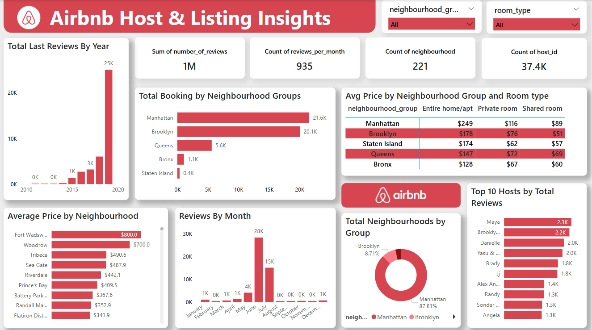

# 🏡 Airbnb Listings Analysis Dashboard – Power BI Project

This project visualizes Airbnb listing data from New York City using an interactive Power BI dashboard. It analyzes trends across neighborhoods, room types, prices, availability, and reviews, offering actionable insights for improving listing strategy and customer engagement.

---

## 🎯 Objective
To explore Airbnb listing data and:
- Understand price differences across neighborhoods and room types
- Identify high-performing hosts and areas with the most listings
- Analyze customer behavior based on review patterns
- Visualize key metrics to assist stakeholders in making data-driven decisions

---

## 📊 Key KPIs
| Metric                  | Value     |
|-------------------------|-----------|
| 🧑‍💼 Total Hosts          | 37.4K     |
| 📍 Neighborhoods         | 221       |
| 💬 Total Reviews         | 2 Million |
| 📈 Avg Reviews/Month     | 935       |

---

## 🔍 Dashboard Insights

### 🏘️ Neighborhood Group Analysis
- **Manhattan** leads with the highest bookings (~21.6K), followed closely by **Brooklyn (20.1K)**
- **Queens, Bronx, and Staten Island** have comparatively lower booking volumes

### 💸 Pricing Trends by Room Type
- **Entire homes/apartments** in Manhattan are the most expensive (avg $249)
- **Shared and private rooms** are most affordable in the Bronx
- **Brooklyn and Queens** offer competitive mid-range options

### 📍 Most Expensive Neighborhoods
- Fort Wadsworth: $800 avg  
- Woodrow: $700  
- Tribeca, Sea Gate, and Riverdale follow as premium areas

### 📅 Review Patterns
- Reviews peak in **July (28K)** and **August (15K)**, indicating high summer demand
- Minimal activity from **October to December**, suggesting off-season

### 🏆 Top Hosts
- Hosts like **Maya**, **Danielle**, and **Yasu & Jun** top the list with 2K+ reviews
- High review counts hint at strong host reputation and possibly multiple listings

### 🗺️ Coverage by Neighborhood
- **Manhattan dominates** with nearly 88% of all listings
- Brooklyn holds ~9%, showing it as a growing but secondary hub

---

## 📈 Dashboard Features
- Dynamic filters for **Neighborhood Group** and **Room Type**
- Interactive visuals: bar charts, pie charts, KPIs, and line graphs
- Pricing comparisons, host analysis, and seasonal patterns
- Clean layout following Airbnb’s brand colors

---

## 🛠️ Tools Used
- **Power BI** – data modeling, DAX, interactive dashboard
- **Microsoft Excel** – initial data cleaning and formatting
- **Airbnb Public NYC Dataset** – contains host, location, price, reviews, and availability data

---

## 📸 Dashboard Preview

---

## 📂 Repository Contents
- `Airbnb_Dashboard_Screenshot.png` – High-quality dashboard snapshot  
- `Airbnb_Dashboard_Report.pptx` – Project summary report (optional)  
- `README.md` – This documentation file  
- (Optional) `Dataset_Sample.csv` – Sample cleaned dataset (if public license allows)

---

## 🤝 Connect with Me
👨‍💻 **Arya Bhor**  
🔗 [LinkedIn Profile](www.linkedin.com/in/aryabhor1001)  
💼 [GitHub Portfolio](https://github.com/arya10012)

